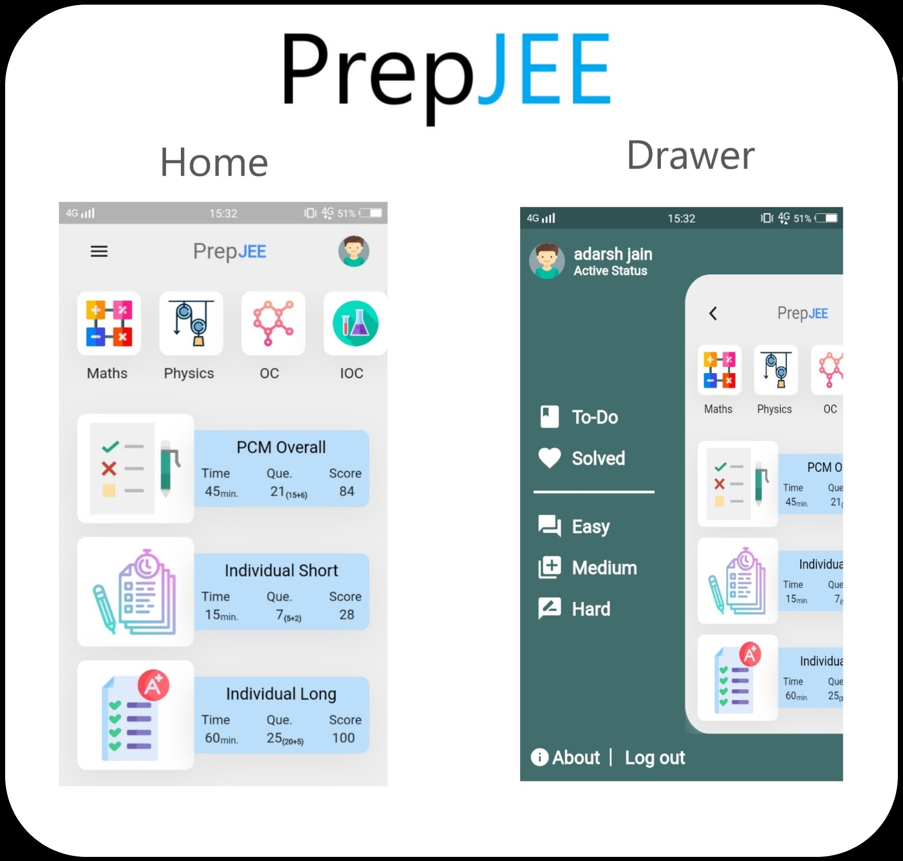

# PrepJEE

An Android app (Flutter APP) that assists students in JEE preparation by providing an excellent question practice and a contest participation experience

PrepJEE allows students to apply subjects/topic tags, accuracy filter also to choose a difficulty level and then keep track of “Todo” and “Solved” marks.

Generates contest submission report consisting of performance analysis and comparative standing with access to contest solutions

## Getting Started

This project is a starting point for a Flutter application.

A few resources to get you started if this is your first Flutter project:

- [Lab: Write your first Flutter app](https://flutter.dev/docs/get-started/codelab)
- [Cookbook: Useful Flutter samples](https://flutter.dev/docs/cookbook)

For help getting started with Flutter, view our
[online documentation](https://flutter.dev/docs), which offers tutorials,
samples, guidance on mobile development, and a full API reference.
